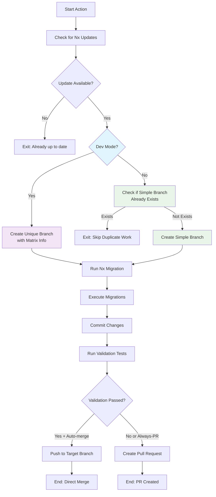

# Nx Migration Action

Automatically migrate your Nx workspace to the latest version with smart validation and PR creation.

## Features

- 🔄 **Automatic Updates**: Checks for and applies Nx updates automatically
- 🛠️ **Migration Handling**: Runs Nx migrations when available
- ✅ **Validation**: Runs configurable validation commands (build, test, etc.)
- 🤖 **Smart Branching**: Auto-merge on success, create PR on failure
- 📦 **Multi Package Manager**: Supports npm, yarn, and pnpm
- ⚙️ **Highly Configurable**: Customize every aspect of the migration process
- 🏷️ **Auto Labeling**: Automatically labels PRs for easy organization

## Quick Start

### Basic Usage

```yaml
name: Nx Migration
on:
  workflow_dispatch:
  schedule:
    - cron: '0 1 * * *'  # Daily at 1 AM

jobs:
  nx-migrate:
    runs-on: ubuntu-latest
    steps:
      - uses: actions/checkout@v4
        with:
          fetch-depth: 0
          
      - uses: gridatek/nx-migrate-action@v0
        with:
          github-token: ${{ secrets.GITHUB_TOKEN }}
```

### Advanced Configuration

```yaml
name: Nx Migration
on:
  workflow_dispatch:
  schedule:
    - cron: '0 1 * * 1'  # Weekly on Mondays

jobs:
  nx-migrate:
    runs-on: ubuntu-latest
    permissions:
      contents: write
      pull-requests: write
      
    steps:
      - uses: actions/checkout@v4
        with:
          fetch-depth: 0
          
      - uses: gridatek/nx-migrate-action@v0
        with:
          github-token: ${{ secrets.GITHUB_TOKEN }}
          node-version: '18'
          package-manager: 'pnpm'
          validation-commands: 'build,test,lint,e2e'
          validation-scope: 'all'
          merge-strategy: 'always-pr'
          pr-labels: 'dependencies,nx-migration,high-priority'
          target-branch: 'develop'
```

## Configuration Options

| Input | Description                                  | Default | Required |
|-------|----------------------------------------------|---------|----------|
| `github-token` | GitHub token for creating PRs and pushing    | `${{ github.token }}` | Yes |
| `nx-package` | The Nx package to check for updates          | `nx` | No |
| `nx-version` | Nx version to use (latest, next, or specific version like 19.8.0) | `latest` | No |
| `node-version` | Node.js version to use                       | `22` | No |
| `package-manager` | Package manager (npm, yarn, pnpm)            | `npm` | No |
| `validation-commands` | Validation commands (comma-separated)        | `build` | No |
| `validation-scope` | Validation scope (all, affected)             | `affected` | No |
| `merge-strategy` | Merge strategy after validation (auto-merge, always-pr) | `auto-merge` | No |
| `pr-labels` | PR labels (comma-separated)                  | `nx-migrate-action` | No |
| `commit-message-prefix` | Commit message prefix                        | `build` | No |
| `target-branch` | Target branch for changes                    | `main` | No |
| `working-directory` | Working directory                            | `.` | No |
| `push-migrations-json` | Push migrations.json to repository after successful migration | `false` | No |
| `dev-mode` | Enable dev mode for testing (creates unique branches with matrix info) | `false` | No |

## Outputs

| Output | Description |
|--------|-------------|
| `updated` | Whether Nx was updated |
| `current-version` | Current Nx version before update |
| `latest-version` | Latest Nx version |
| `has-migrations` | Whether migrations were found |
| `validation-result` | Result of validation tests |
| `pr-url` | URL of created PR (if any) |

## Usage Examples

### With Different Package Managers

#### npm (default)
```yaml
- uses: gridatek/nx-migrate-action@v0
  with:
    github-token: ${{ secrets.GITHUB_TOKEN }}
```

#### Yarn
```yaml
- uses: gridatek/nx-migrate-action@v0
  with:
    github-token: ${{ secrets.GITHUB_TOKEN }}
    package-manager: 'yarn'
```

#### pnpm
```yaml
- uses: gridatek/nx-migrate-action@v0
  with:
    github-token: ${{ secrets.GITHUB_TOKEN }}
    package-manager: 'pnpm'
```

### Conservative Approach (Always Create PRs)

```yaml
- uses: gridatek/nx-migrate-action@v0
  with:
    github-token: ${{ secrets.GITHUB_TOKEN }}
    merge-strategy: 'always-pr'
    validation-commands: 'build,test,lint'
```

### Fast Auto-merge (Default Strategy)

```yaml
- uses: gridatek/nx-migrate-action@v0
  with:
    github-token: ${{ secrets.GITHUB_TOKEN }}
    # Uses auto-merge by default
    # Only runs build validation by default
```

### Dev Mode vs Production Mode

The action supports two modes to handle different use cases:

#### Production Mode (Default)
```yaml
- uses: gridatek/nx-migrate-action@v0
  with:
    github-token: ${{ secrets.GITHUB_TOKEN }}
    # dev-mode defaults to 'false'
```

**Features:**
- Creates simple branch names: `nx-migrate-21.5.3`
- Checks if branch already exists and skips if found
- Prevents duplicate migration work
- Creates single clean PR per version
- Ideal for real production migrations

#### Dev Mode (Testing)
```yaml
- uses: gridatek/nx-migrate-action@v0
  with:
    github-token: ${{ secrets.GITHUB_TOKEN }}
    dev-mode: 'true'
```

**Features:**
- Creates unique branches with matrix info: `nx-migrate-21.5.3-package-manager-yarn-node-version-24-18059576033-1`
- Each matrix job creates separate PRs
- Useful for testing workflows and validating across different configurations
- Includes matrix variables in PR titles for identification

### Matrix Testing Strategy

#### Testing Different Configurations
```yaml
name: Test Nx Migration
on: workflow_dispatch

jobs:
  test-migration:
    runs-on: ubuntu-latest
    strategy:
      matrix:
        package-manager: [npm, yarn, pnpm]
        node-version: [22, 24]

    steps:
      - uses: actions/checkout@v4
        with:
          fetch-depth: 0

      - uses: gridatek/nx-migrate-action@v0
        with:
          github-token: ${{ secrets.GITHUB_TOKEN }}
          package-manager: ${{ matrix.package-manager }}
          node-version: ${{ matrix.node-version }}
          dev-mode: 'true'  # Creates 6 unique PRs for testing
```

#### Production Migration
```yaml
name: Nx Migration
on:
  schedule:
    - cron: '0 2 * * 1'  # Weekly on Mondays

jobs:
  migrate:
    runs-on: ubuntu-latest
    steps:
      - uses: actions/checkout@v4
        with:
          fetch-depth: 0

      - uses: gridatek/nx-migrate-action@v0
        with:
          github-token: ${{ secrets.GITHUB_TOKEN }}
          # dev-mode: false (default) - single clean migration
```

### Multiple Nx Packages

You can run the action multiple times for different Nx packages:

```yaml
steps:
  - uses: actions/checkout@v4
    with:
      fetch-depth: 0

  - uses: gridatek/nx-migrate-action@v0
    with:
      github-token: ${{ secrets.GITHUB_TOKEN }}
      nx-package: 'nx'

  - uses: gridatek/nx-migrate-action@v0
    with:
      github-token: ${{ secrets.GITHUB_TOKEN }}
      nx-package: '@nx/angular'
```

## How It Works



### Workflow Steps

1. **Version Detection**: Compares current Nx version with latest available using package manager commands
2. **Mode Selection**:
   - **Dev Mode**: Creates unique branches with matrix information for testing
   - **Prod Mode**: Uses simple branch names and checks for existing branches
3. **Migration Process**: Runs `nx migrate latest` if update is available
4. **Code Migrations**: Executes any migrations found in `migrations.json`
5. **Validation**: Runs specified validation commands (build, test, lint, etc.)
6. **Smart Deployment**:
   - ✅ **Auto-merge**: Push directly to target branch if validation passes
   - 🔍 **Create PR**: Generate pull request for manual review if validation fails or always-pr strategy is used

## Workflow Strategies

### Daily Updates (Aggressive)
```yaml
on:
  schedule:
    - cron: '0 2 * * *'  # Daily at 2 AM
```

### Weekly Updates (Balanced)
```yaml
on:
  schedule:
    - cron: '0 2 * * 1'  # Monday at 2 AM
```

### Monthly Updates (Conservative)
```yaml
on:
  schedule:
    - cron: '0 2 1 * *'  # First day of month at 2 AM
```

## Permissions

Your workflow needs these permissions:

```yaml
permissions:
  contents: write      # To push commits and create branches
  pull-requests: write # To create and manage PRs
```

### Important Notes:
- **Organization repositories**: May need additional setup for GitHub CLI authentication
- **Branch protection**: The action respects branch protection rules - PRs will be created if direct push is blocked
- **Token permissions**: Use `${{ secrets.GITHUB_TOKEN }}` which has appropriate permissions for most repositories

## Security Considerations

- The action uses the provided GitHub token for authentication
- All operations respect your repository's branch protection rules
- No sensitive data is logged or exposed
- Commits are signed with a dedicated bot account

## Troubleshooting

### Common Issues

**"No changes to commit"**
- This is normal when Nx is already up to date

**"Validation failed"**
- Check the workflow logs for specific test failures
- The action will create a PR for manual review

**"Permission denied"**
- Ensure your workflow has `contents: write` and `pull-requests: write` permissions

**"Package manager not found"**
- Verify your package manager is correctly specified and available

### Debug Mode

Enable verbose logging:

```yaml
- uses: gridatek/nx-migrate-action@v0
  with:
    github-token: ${{ secrets.GITHUB_TOKEN }}
  env:
    ACTIONS_STEP_DEBUG: true
```

## Contributing

1. Fork the repository
2. Create a feature branch
3. Make your changes
4. Add tests if applicable
5. Submit a pull request

## License

MIT License - see [LICENSE](LICENSE) file for details.

## Recent Updates

### Dev/Prod Mode Support
- **Dev Mode**: Added `dev-mode` input for testing workflows with matrix strategies
  - Creates unique branches with matrix info: `nx-migrate-21.5.3-package-manager-yarn-node-version-24-...`
  - Each matrix job creates separate PRs for comprehensive testing
  - Includes matrix variables in PR titles for easy identification
- **Prod Mode** (default): Optimized for production use
  - Simple branch names: `nx-migrate-21.5.3`
  - Checks if branch already exists and skips duplicate work
  - Single clean PR per version update

### Version Detection Improvements
- **Fixed yarn version detection**: Now correctly displays actual version numbers instead of version tags (e.g., "21.2.2 → 21.5.3" instead of "21.2.2 → latest")
- **Enhanced package manager support**: Improved reliability across npm, yarn, and pnpm
- **Updated default PR labels**: Simplified to use `nx-migrate-action` for better action identification

## Changelog

See [CHANGELOG.md](CHANGELOG.md) for version history and updates.