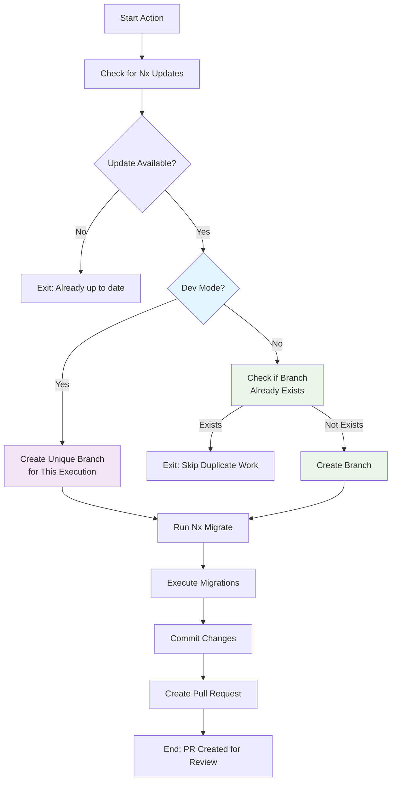

# Nx Migrate Action

Automatically migrate your Nx workspace to the latest version and create PRs for review and validation. Optional auto-merge workflow available for seamless CI integration.

## Features

- 🔄 **Automatic Updates**: Checks for and applies Nx updates automatically
- 🛠️ **Migration Handling**: Runs Nx migrations when available
- 🔄 **Always Creates PRs**: All migrations create PRs for proper review and CI validation
- 🤖 **Optional Auto-merge**: Separate workflow can auto-merge PRs after CI validation passes
- 📦 **Multi Package Manager**: Supports npm, yarn, and pnpm
- ⚙️ **Configurable**: Customize migration process and PR settings
- 🏷️ **Auto Labeling**: Automatically labels PRs for easy organization

## Prerequisites

This action requires Node.js to be set up in your workflow before use. The action runs Nx commands (`npx nx migrate`) and package manager operations that require Node.js.

**Required setup:**

- Use `actions/setup-node@v4` before calling this action
- Configure the appropriate cache for your package manager
- Ensure Node.js version is compatible with your Nx workspace

## Quick Start

### Basic Usage

```yaml
name: Nx Migrate
on:
  workflow_dispatch:
  schedule:
    - cron: '0 1 * * *' # Daily at 1 AM

jobs:
  nx-migrate:
    runs-on: ubuntu-latest
    steps:
      - uses: actions/checkout@v4
        with:
          fetch-depth: 0

      - uses: actions/setup-node@v4
        with:
          node-version: '22'
          cache: 'npm' # or 'yarn', 'pnpm'

      - uses: gridatek/nx-migrate-action@v0
        env:
          GITHUB_TOKEN: ${{ secrets.GITHUB_TOKEN }}
```

### Advanced Configuration

```yaml
name: Nx Migrate
on:
  workflow_dispatch:
  schedule:
    - cron: '0 1 * * 1' # Weekly on Mondays

jobs:
  nx-migrate:
    runs-on: ubuntu-latest
    permissions:
      contents: write
      pull-requests: write

    steps:
      - uses: actions/checkout@v4
        with:
          fetch-depth: 0

      - uses: actions/setup-node@v4
        with:
          node-version: '18'
          cache: 'pnpm'

      - uses: gridatek/nx-migrate-action@v0
        env:
          GITHUB_TOKEN: ${{ secrets.GITHUB_TOKEN }}
        with:
          package-manager: 'pnpm'
          pr-labels: 'dependencies,nx-migration,high-priority'
```

## Configuration Options

### Core Migration Settings

| Input             | Description                                                                          | Default  | Required |
| ----------------- | ------------------------------------------------------------------------------------ | -------- | -------- |
| `nx-package`      | The Nx package to check for updates                                                  | `nx`     | No       |
| `nx-version`      | Version to use when fetching updates (latest, next, or specific version like 19.8.0) | `latest` | No       |
| `package-manager` | Package manager (npm, yarn, pnpm)                                                    | `npm`    | No       |

### PR Configuration

| Input                   | Description                 | Default             | Required |
| ----------------------- | --------------------------- | ------------------- | -------- |
| `pr-labels`             | PR labels (comma-separated) | `nx-migrate-action` | No       |
| `commit-message-prefix` | Commit message prefix       | `build`             | No       |

### Advanced Options

| Input                   | Description                                                                         | Default | Required |
| ----------------------- | ----------------------------------------------------------------------------------- | ------- | -------- |
| `skip-initial-install`  | Skip initial dependency installation (useful if dependencies are already installed) | `false` | No       |
| `push-migrations-json`  | Push migrations.json to repository after successful migration                       | `false` | No       |
| `create-missing-labels` | Create missing labels in the repository                                             | `true`  | No       |

### Dev/Testing Options

| Input               | Description                                                            | Default | Required |
| ------------------- | ---------------------------------------------------------------------- | ------- | -------- |
| `working-directory` | Working directory                                                      | `.`     | No       |
| `dev-mode`          | Enable dev mode for testing (creates unique branches with matrix info) | `false` | No       |

## Outputs

| Output            | Description                      |
| ----------------- | -------------------------------- |
| `updated`         | Whether Nx was updated           |
| `current-version` | Current Nx version before update |
| `target-version`  | Target Nx version for migration  |
| `has-migrations`  | Whether migrations were found    |
| `pr-url`          | URL of created PR (if any)       |

## Usage Examples

### With Different Package Managers

#### npm (default)

```yaml
- uses: actions/setup-node@v4
  with:
    node-version: '22'
    cache: 'npm'
- uses: gridatek/nx-migrate-action@v0
  env:
    GITHUB_TOKEN: ${{ secrets.GITHUB_TOKEN }}
```

#### Yarn

```yaml
- uses: actions/setup-node@v4
  with:
    node-version: '22'
    cache: 'yarn'
- uses: gridatek/nx-migrate-action@v0
  env:
    GITHUB_TOKEN: ${{ secrets.GITHUB_TOKEN }}
  with:
    package-manager: 'yarn'
```

#### pnpm

```yaml
- uses: actions/setup-node@v4
  with:
    node-version: '22'
    cache: 'pnpm'
- uses: gridatek/nx-migrate-action@v0
  env:
    GITHUB_TOKEN: ${{ secrets.GITHUB_TOKEN }}
  with:
    package-manager: 'pnpm'
```

### Custom PR Labels

```yaml
- uses: actions/setup-node@v4
  with:
    node-version: '22'
    cache: 'npm'
- uses: gridatek/nx-migrate-action@v0
  env:
    GITHUB_TOKEN: ${{ secrets.GITHUB_TOKEN }}
  with:
    pr-labels: 'dependencies,nx-migration,high-priority'
```

### Optional Auto-merge After CI Validation

You can add an optional workflow to automatically merge Nx migration PRs after all CI checks pass. See the demo repository for a complete example with branch protection: https://github.com/gridatek/nx-migrate-action-demo

### Dev Mode vs Production Mode

The action supports two modes to handle different use cases:

#### Production Mode (Default)

```yaml
- uses: actions/setup-node@v4
  with:
    node-version: '22'
    cache: 'npm'
- uses: gridatek/nx-migrate-action@v0
  env:
    GITHUB_TOKEN: ${{ secrets.GITHUB_TOKEN }}
  # dev-mode defaults to 'false'
```

**Features:**

- Creates simple branch names: `nx-migrate-21.5.3`
- Checks if branch already exists and skips if found
- Prevents duplicate migration work
- Creates single clean PR per version
- Ideal for real production migrations

#### Dev Mode (Testing)

```yaml
- uses: actions/setup-node@v4
  with:
    node-version: '22'
    cache: 'npm'
- uses: gridatek/nx-migrate-action@v0
  env:
    GITHUB_TOKEN: ${{ secrets.GITHUB_TOKEN }}
  with:
    dev-mode: 'true'
```

**Features:**

- Creates unique branches with matrix info: `nx-migrate-21.5.3-package-manager-yarn-node-version-24-18059576033-1`
- Each matrix job creates separate PRs
- Useful for testing workflows and validating across different configurations
- Includes matrix variables in PR titles for identification

### Matrix Testing Strategy

#### Testing Different Configurations

```yaml
name: Test Nx Migrate
on: workflow_dispatch

jobs:
  test-migration:
    runs-on: ubuntu-latest
    strategy:
      matrix:
        package-manager: [npm, yarn, pnpm]
        node-version: [22, 24]

    steps:
      - uses: actions/checkout@v4
        with:
          fetch-depth: 0

      - uses: actions/setup-node@v4
        with:
          node-version: ${{ matrix.node-version }}
          cache: ${{ matrix.package-manager }}

      - uses: gridatek/nx-migrate-action@v0
        env:
          GITHUB_TOKEN: ${{ secrets.GITHUB_TOKEN }}
        with:
          package-manager: ${{ matrix.package-manager }}
          dev-mode: 'true' # Creates 6 unique PRs for testing
```

#### Production Migration with Auto-merge

```yaml
name: Nx Migrate
on:
  schedule:
    - cron: '0 2 * * 1' # Weekly on Mondays

jobs:
  migrate:
    runs-on: ubuntu-latest
    steps:
      - uses: actions/checkout@v4
        with:
          fetch-depth: 0

      - uses: actions/setup-node@v4
        with:
          node-version: '22'
          cache: 'npm'

      - uses: gridatek/nx-migrate-action@v0
        env:
          GITHUB_TOKEN: ${{ secrets.GITHUB_TOKEN }}
        # Creates clean PR that will auto-merge if CI passes
        # (requires auto-merge workflow to be added)
```

### Multiple Nx Packages

You can run the action multiple times for different Nx packages:

```yaml
steps:
  - uses: actions/checkout@v4
    with:
      fetch-depth: 0

  - uses: actions/setup-node@v4
    with:
      node-version: '22'
      cache: 'npm'

  - uses: gridatek/nx-migrate-action@v0
    env:
      GITHUB_TOKEN: ${{ secrets.GITHUB_TOKEN }}
    with:
      nx-package: 'nx'

  - uses: gridatek/nx-migrate-action@v0
    env:
      GITHUB_TOKEN: ${{ secrets.GITHUB_TOKEN }}
    with:
      nx-package: '@nx/angular'
```

## How It Works



### Workflow Steps

1. **Version Detection**: Compares current Nx version with target version using package manager commands
2. **Mode Selection**:
   - **Dev Mode**: Creates unique branches with matrix information for testing
   - **Prod Mode**: Uses simple branch names and checks for existing branches
3. **Migration Process**: Runs `nx migrate` with specified version if update is available
4. **Code Migrations**: Executes any migrations found in `migrations.json`
5. **PR Creation**: Always creates a pull request targeting the current workflow branch for review and validation by repository CI/CD
6. **Validation**: Repository's existing CI/CD workflows handle testing, building, and validation

## Workflow Strategies

### Daily Updates (Aggressive)

```yaml
on:
  schedule:
    - cron: '0 2 * * *' # Daily at 2 AM
```

### Weekly Updates (Balanced) - Recommended with Auto-merge

```yaml
on:
  schedule:
    - cron: '0 2 * * 1' # Monday at 2 AM
# Best balance of staying current while allowing time for CI validation
```

### Monthly Updates (Conservative)

```yaml
on:
  schedule:
    - cron: '0 2 1 * *' # First day of month at 2 AM
# Minimal disruption, manual review preferred
```

## Permissions

Your workflow needs these permissions:

```yaml
permissions:
  contents: write # To push commits and create branches
  pull-requests: write # To create and manage PRs
```

### Important Notes:

- **Organization repositories**: May need additional setup for GitHub CLI authentication
- **Branch protection**: The action respects branch protection rules - PRs will be created if direct push is blocked
- **Token permissions**: Use `${{ secrets.GITHUB_TOKEN }}` which has appropriate permissions for most repositories
- **Auto-merge workflow**: If using auto-merge, ensure the workflow has the same permissions as above

## Security Considerations

- The action uses the provided GitHub token for authentication
- All operations respect your repository's branch protection rules
- No sensitive data is logged or exposed
- Commits are signed with a dedicated bot account

## Troubleshooting

### Common Issues

**"No changes to commit"**

- This is normal when Nx is already up to date

**"Migration failed"**

- Check the workflow logs for specific migration failures
- Ensure your Nx workspace is in a clean state before running migrations

**"Permission denied"**

- Ensure your workflow has `contents: write` and `pull-requests: write` permissions

**"Package manager not found"**

- Verify your package manager is correctly specified and available

**"Auto-merge not working"**

- Ensure you've added the optional auto-merge workflow (`.github/workflows/auto-merge-nx-prs.yml`)
- Check that your repository has the required permissions for the workflow
- Verify that your CI checks are properly configured and passing

### Debug Mode

Enable verbose logging:

```yaml
- uses: actions/setup-node@v4
  with:
    node-version: '22'
    cache: 'npm'
- uses: gridatek/nx-migrate-action@v0
  env:
    GITHUB_TOKEN: ${{ secrets.GITHUB_TOKEN }}
    ACTIONS_STEP_DEBUG: true
```

## Contributing

1. Fork the repository
2. Create a feature branch
3. Make your changes
4. Add tests if applicable
5. Submit a pull request

## License

MIT License - see [LICENSE](LICENSE) file for details.

## Recent Updates

### Simplified Validation Strategy

- **Removed built-in validation**: Action now focuses solely on migration and PR creation
- **Repository CI integration**: Leverages existing CI/CD workflows for validation
- **Always creates PRs**: Modern approach that uses standard GitHub review process
- **Optional auto-merge**: Added workflow to automatically merge PRs after CI validation passes
- **Better developer experience**: Re-runnable tests, proper CI environment, standard workflows

### Dev/Prod Mode Support

- **Dev Mode**: Added `dev-mode` input for testing workflows with matrix strategies
  - Creates unique branches with matrix info: `nx-migrate-21.5.3-package-manager-yarn-node-version-24-...`
  - Each matrix job creates separate PRs for comprehensive testing
  - Includes matrix variables in PR titles for easy identification
- **Prod Mode** (default): Optimized for production use
  - Simple branch names: `nx-migrate-21.5.3`
  - Checks if branch already exists and skips duplicate work
  - Single clean PR per version update

### Version Detection Improvements

- **Fixed yarn version detection**: Now correctly displays actual version numbers instead of version tags (e.g., "21.2.2 → 21.5.3" instead of "21.2.2 → latest")
- **Enhanced package manager support**: Improved reliability across npm, yarn, and pnpm
- **Updated default PR labels**: Simplified to use `nx-migrate-action` for better action identification

## Changelog

See [CHANGELOG.md](CHANGELOG.md) for version history and updates.
