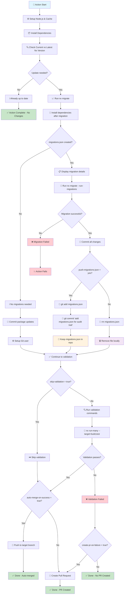

# 🔄 Complete Action Flow Diagram

This diagram explains the complete nx-migrate-action process from setup to completion.

## 📊 Flow Chart



## 🎯 Key Decision Points

### 1. **Update Check**
- **Update Available**: Proceeds with migration process
- **Already Up-to-date**: Action completes successfully with no changes

### 2. **migrations.json Creation**
- **Created**: Nx found changes requiring migrations
- **Not Created**: No migrations needed, commits package updates only

### 3. **Migration Execution**
- **Success**: Migrations applied successfully, continues to validation
- **Failure**: Action stops and reports error

### 4. **push-migrations-json Option**
- **`yes`**: Commits migrations.json to repository for audit trail
- **`false`** (default): Removes migrations.json locally after success

### 5. **Validation Control**
- **skip-validation = true**: Bypasses all validation, goes to branching logic
- **skip-validation = false**: Runs configured validation commands

### 6. **Branching Strategy**
- **Auto-merge**: Direct push to target branch if validation passes and enabled
- **PR Creation**: Creates PR if validation fails or auto-merge disabled

## 📝 Example Scenarios

### Scenario A: Complete Success with Auto-merge
```
Start → Setup → Install → Version Check → Migrate → Run Migrations → Validate → Auto-merge ✅
```

### Scenario B: Validation Failure with PR Creation
```
Start → Setup → Install → Version Check → Migrate → Run Migrations → Validate ❌ → Create PR
```

### Scenario C: No Update Needed
```
Start → Setup → Install → Version Check → Already up-to-date ✅
```

### Scenario D: Skip Validation with PR
```
Start → Setup → Install → Version Check → Migrate → Skip Validation → Create PR
```

### Scenario E: Migration File Audit Trail
```
Start → Setup → Install → Version Check → Migrate → Commit migrations.json → Validate → Auto-merge/PR
```

### Scenario F: Migration Execution Failure
```
Start → Setup → Install → Version Check → Migrate → Migration fails ❌ → Action fails
```

## 🔧 Configuration Impact

| Setting | Result |
|---------|--------|
| `nx-version-tag: latest` | Uses stable release version |
| `nx-version-tag: canary/next` | Uses pre-release version |
| `push-migrations-json: yes` | migrations.json preserved in Git history |
| `push-migrations-json: false` | migrations.json removed after successful migration |
| `auto-merge-on-success: true` | Direct push to target branch when validation passes |
| `auto-merge-on-success: false` | Always create PR for review |
| `skip-validation: true` | Skip validation commands, proceed to branching logic |
| `skip-validation: false` | Run validation commands before branching |
| `create-pr-on-failure: true` | Create PR when validation fails |
| `create-pr-on-failure: false` | No PR creation on validation failure |
| `validation-scope: affected` | Only validate affected projects |
| `validation-scope: all` | Validate all projects in workspace |

## 🎨 Legend

- 🚀 **Start/Action**: Process initiation
- 📦 **Process**: Core operations
- ❓ **Decision**: Conditional logic points
- 📁 **Storage**: File persistence
- 🗑️ **Cleanup**: File removal
- ✅ **Success**: Successful completion
- ❌ **Failure**: Error states