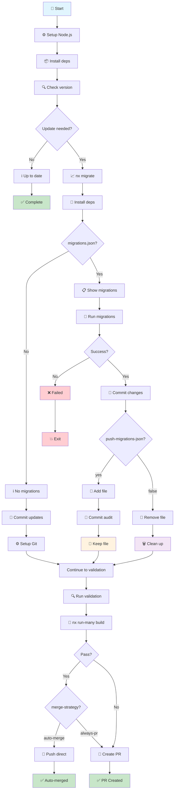

# 🔄 Complete Action Flow Diagram

This diagram explains the complete nx-migrate-action process from setup to completion.

## 📊 Flow Chart



## 📋 Detailed Step Descriptions

### Setup Phase
- **🚀 Start**: Action begins execution
- **⚙️ Setup Node.js**: Configure Node.js version and package manager cache
- **📦 Install deps**: Install project dependencies using configured package manager

### Version Check Phase
- **🔍 Check version**: Compare current Nx package version with latest/specified tag
- **Update needed?**: Determine if an update is available

### Migration Phase (if update needed)
- **📈 nx migrate**: Run `nx migrate [version-tag]` to update package.json and generate migrations
- **🔧 Install deps**: Install updated dependencies after package.json changes
- **migrations.json?**: Check if migration file was created by Nx

### Migration Execution (if migrations.json exists)
- **📋 Show migrations**: Display migration details found in migrations.json
- **🔧 Run migrations**: Execute `nx migrate --run-migrations` to apply code changes
- **Success?**: Verify migrations completed without errors

### Git Operations
- **📝 Commit updates/changes**: Commit package.json updates or all migration changes
- **⚙️ Setup Git**: Configure git user for automated commits
- **push-migrations-json?**: Check configuration for migration file handling
- **📝 Add file / 💾 Commit audit**: Keep migrations.json in repository for audit trail
- **🧹 Remove file / 🗑️ Clean up**: Remove migrations.json locally after successful migration

### Validation Phase
- **🔍 Run validation**: Execute configured validation commands (default: build)
- **🎯 nx run-many build**: Run `nx run-many --target=build --affected` by default
- **Pass?**: Verify all validation commands succeeded

### Strategy Decision (on validation success)
- **merge-strategy?**: Check merge strategy setting
- **auto-merge**: Auto-merge when validation passes
- **always-pr**: Create PR even when validation passes

### Final Actions
- **🚀 Push direct**: Push changes directly to target branch (auto-merge)
- **📝 Create PR**: Create pull request with detailed information

### Completion
- **✅ Complete**: Action finished - no changes needed
- **✅ Auto-merged**: Changes pushed directly to target branch
- **✅ PR Created**: Pull request created for review
- **✅ No PR**: Validation failed but no PR creation requested
- **💥 Exit**: Action failed due to migration errors

## 🎯 Key Decision Points

### 1. **Update Check**
- **Update Available**: Proceeds with migration process
- **Already Up-to-date**: Action completes successfully with no changes

### 2. **migrations.json Creation**
- **Created**: Nx found changes requiring migrations
- **Not Created**: No migrations needed, commits package updates only

### 3. **Migration Execution**
- **Success**: Migrations applied successfully, continues to validation
- **Failure**: Action stops and reports error

### 4. **push-migrations-json Option**
- **`yes`**: Commits migrations.json to repository for audit trail
- **`false`** (default): Removes migrations.json locally after success

### 5. **Merge Strategy**
- **auto-merge**: Auto-merge if validation passes, create PR if validation fails
- **always-pr**: Always create PR regardless of validation result

## 📝 Example Scenarios

### Scenario A: Complete Success with Auto-merge (Default)
```
Start → Setup → Install → Version Check → Migrate → Run Migrations → Build Validation ✅ → Auto-merge ✅
```

### Scenario B: Validation Failure with PR Creation
```
Start → Setup → Install → Version Check → Migrate → Run Migrations → Build Validation ❌ → Create PR
```

### Scenario C: Always Create PR Strategy
```
Start → Setup → Install → Version Check → Migrate → Run Migrations → Build Validation ✅ → Create PR
```

### Scenario D: No Update Needed
```
Start → Setup → Install → Version Check → Already up-to-date ✅
```

### Scenario E: Migration File Audit Trail
```
Start → Setup → Install → Version Check → Migrate → Commit migrations.json → Validate → Auto-merge/PR
```

### Scenario F: Migration Execution Failure
```
Start → Setup → Install → Version Check → Migrate → Migration fails ❌ → Action fails
```

## 🔧 Configuration Impact

| Setting | Result |
|---------|--------|
| `nx-version-tag: latest` | Uses stable release version |
| `nx-version-tag: canary/next` | Uses pre-release version |
| `push-migrations-json: yes` | migrations.json preserved in Git history |
| `push-migrations-json: false` | migrations.json removed after successful migration |
| `merge-strategy: auto-merge` | Auto-merge on validation success, PR on failure |
| `merge-strategy: always-pr` | Always create PR regardless of validation result |
| `validation-scope: affected` | Only validate affected projects |
| `validation-scope: all` | Validate all projects in workspace |

## 🎨 Legend

- 🚀 **Start/Action**: Process initiation
- 📦 **Process**: Core operations
- ❓ **Decision**: Conditional logic points
- 📁 **Storage**: File persistence
- 🗑️ **Cleanup**: File removal
- ✅ **Success**: Successful completion
- ❌ **Failure**: Error states