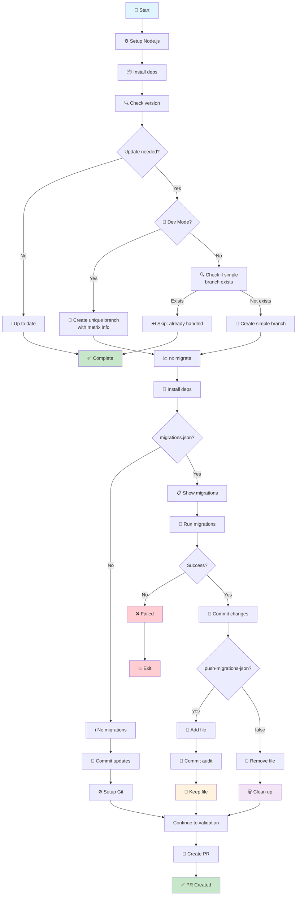

# 🔄 Complete Action Flow Diagram

This diagram explains the complete nx-migrate-action process from setup to completion.

## 📊 Flow Chart



## 📋 Detailed Step Descriptions

### Setup Phase

- **🚀 Start**: Action begins execution
- **⚙️ Setup Node.js**: Configure Node.js version and package manager cache
- **📦 Install deps**: Install project dependencies using configured package manager

### Version Check Phase

- **🔍 Check version**: Compare current Nx package version with latest/specified tag
- **Update needed?**: Determine if an update is available

### Branch Strategy Phase (if update needed)

- **🎯 Dev Mode?**: Check if action is running in development mode
- **🔀 Create unique branch with matrix info**: Dev mode creates branches like `nx-migrate-21.5.3-yarn-node24-123-1`
- **🔍 Check if simple branch exists**: Prod mode checks for existing branch `nx-migrate-21.5.3`
- **⏭️ Skip: already handled**: Exit early if branch exists to prevent duplicate work
- **🔀 Create simple branch**: Prod mode creates clean branch name

### Migration Phase

- **📈 nx migrate**: Run `nx migrate [version-tag]` to update package.json and generate migrations
- **🔧 Install deps**: Install updated dependencies after package.json changes
- **migrations.json?**: Check if migration file was created by Nx

### Migration Execution (if migrations.json exists)

- **📋 Show migrations**: Display migration details found in migrations.json
- **🔧 Run migrations**: Execute `nx migrate --run-migrations` to apply code changes
- **Success?**: Verify migrations completed without errors

### Git Operations

- **📝 Commit updates/changes**: Commit package.json updates or all migration changes
- **⚙️ Setup Git**: Configure git user for automated commits
- **push-migrations-json?**: Check configuration for migration file handling
- **📝 Add file / 💾 Commit audit**: Keep migrations.json in repository for audit trail
- **🧹 Remove file / 🗑️ Clean up**: Remove migrations.json locally after successful migration

### PR Creation Phase

- **📝 Create PR**: Always create pull request with detailed migration information for review and validation by repository CI/CD

### Optional Auto-merge Phase

- **🤖 Monitor CI**: Optional workflow monitors PR status and waits for all CI checks to complete
- **🔍 Check status**: Verifies all required checks have passed successfully
- **🚀 Auto-merge**: Automatically merges PR when all validations pass, or leaves for manual review if any fail

### Completion

- **✅ Complete**: Action finished - no changes needed
- **✅ PR Created**: Pull request created for review and validation by repository CI/CD
- **🤖 Auto-merged**: PR automatically merged after successful CI validation (if auto-merge workflow enabled)
- **👀 Manual Review**: PR awaiting manual review (auto-merge disabled or CI checks failed)
- **💥 Exit**: Action failed due to migration errors

## 🎯 Key Decision Points

### 1. **Update Check**

- **Update Available**: Proceeds with migration process
- **Already Up-to-date**: Action completes successfully with no changes

### 2. **migrations.json Creation**

- **Created**: Nx found changes requiring migrations
- **Not Created**: No migrations needed, commits package updates only

### 3. **Migration Execution**

- **Success**: Migrations applied successfully, continues to validation
- **Failure**: Action stops and reports error

### 4. **push-migrations-json Option**

- **`yes`**: Commits migrations.json to repository for audit trail
- **`false`** (default): Removes migrations.json locally after success

### 5. **PR Creation Strategy**

- **Always creates PRs**: All successful migrations result in PR creation for proper review and CI validation

### 6. **Auto-merge Strategy (Optional)**

- **Enabled**: Separate workflow monitors PR and auto-merges when all CI checks pass
- **Disabled**: All PRs require manual review and merging

## 📝 Example Scenarios

### Scenario A: Complete Success with PR Creation

```
Start → Setup → Install → Version Check → Migrate → Run Migrations → Create PR ✅
```

### Scenario D: No Update Needed

```
Start → Setup → Install → Version Check → Already up-to-date ✅
```

### Scenario E: Migration File Audit Trail

```
Start → Setup → Install → Version Check → Migrate → Commit migrations.json → Create PR
```

### Scenario F: Migration Execution Failure

```
Start → Setup → Install → Version Check → Migrate → Migration fails ❌ → Action fails
```

### Scenario F: Auto-merge Success

```
Start → Setup → Install → Version Check → Migrate → Run Migrations → Create PR → CI Validation ✅ → Auto-merge ✅
```

### Scenario G: Auto-merge CI Failure

```
Start → Setup → Install → Version Check → Migrate → Run Migrations → Create PR → CI Validation ❌ → Manual Review Required
```

### Scenario H: Dev Mode Matrix Testing

```
Start → Setup → Install → Version Check → Dev Mode → Create unique branch (matrix-info) → Migrate → Create PR
```

### Scenario I: Prod Mode Duplicate Prevention

```
Start → Setup → Install → Version Check → Prod Mode → Branch exists → Skip (no duplicate work)
```

## 🔧 Configuration Impact

| Setting                       | Result                                                 |
| ----------------------------- | ------------------------------------------------------ |
| `dev-mode: true`              | Creates unique branches with matrix info for testing   |
| `dev-mode: false` (default)   | Creates simple branches with duplicate detection       |
| `nx-version-tag: latest`      | Uses stable release version                            |
| `nx-version-tag: canary/next` | Uses pre-release version                               |
| `push-migrations-json: yes`   | migrations.json preserved in Git history               |
| `push-migrations-json: false` | migrations.json removed after successful migration     |
| Always creates PRs            | All migrations create PRs for repository CI validation |
| Auto-merge workflow enabled   | PRs auto-merge when all CI checks pass                 |
| Auto-merge workflow disabled  | All PRs require manual review and merging              |

## 🎨 Legend

- 🚀 **Start/Action**: Process initiation
- 📦 **Process**: Core operations
- ❓ **Decision**: Conditional logic points
- 📁 **Storage**: File persistence
- 🗑️ **Cleanup**: File removal
- ✅ **Success**: Successful completion
- ❌ **Failure**: Error states
