# 🔄 Migration Flow Diagram

This diagram explains how the nx-migrate-action handles migrations.json in different scenarios.

## 📊 Flow Chart

```mermaid
flowchart TD
    A[🚀 Start Migration] --> B[📦 Run nx migrate latest]
    B --> C{migrations.json created?}

    C -->|No| D[ℹ️ No migrations needed]
    D --> E[✅ Migration Complete]

    C -->|Yes| F[📋 Display migration details]
    F --> G[🔧 Run nx migrate --run-migrations]
    G --> H{Migration successful?}

    H -->|No| I[❌ Migration Failed]
    I --> J[💥 Action Fails]

    H -->|Yes| K{push-migrations-json = yes?}

    K -->|Yes| L[📝 git add migrations.json]
    L --> M[💾 git commit 'add migrations.json for audit trail']
    M --> N[📁 Keep migrations.json in repo]
    N --> O[✅ Continue to validation]

    K -->|No| P[🧹 rm migrations.json]
    P --> Q[🗑️ Remove file locally]
    Q --> O[✅ Continue to validation]

    O --> R[🔍 Run validation tests]
    R --> S{Validation passes?}

    S -->|Yes & auto-merge=true| T[🚀 Push to main branch]
    S -->|No or auto-merge=false| U[📝 Create Pull Request]

    T --> V[✅ Done - Auto-merged]
    U --> W[✅ Done - PR Created]

    style A fill:#e1f5fe
    style E fill:#c8e6c9
    style V fill:#c8e6c9
    style W fill:#c8e6c9
    style J fill:#ffcdd2
    style I fill:#ffcdd2
    style N fill:#fff3e0
    style Q fill:#f3e5f5
```



## 🎯 Key Decision Points

### 1. **migrations.json Creation**
- **Created**: Nx found changes requiring migrations
- **Not Created**: No migrations needed, process continues

### 2. **Migration Execution**
- **Success**: Migrations applied successfully
- **Failure**: Action stops and reports error

### 3. **push-migrations-json Option**
- **`yes`**: Commits migrations.json to repository for audit trail
- **`false`** (default): Removes migrations.json locally after success

### 4. **Validation & Branching**
- **Auto-merge**: Direct push to main if validation passes
- **PR Creation**: Creates PR if validation fails or auto-merge disabled

## 📝 Example Scenarios

### Scenario A: Standard Migration (push-migrations-json: false)
```
Nx Update → migrations.json created → Migrations run → File removed → Validation → Auto-merge/PR
```

### Scenario B: Audit Trail (push-migrations-json: yes)
```
Nx Update → migrations.json created → Migrations run → File committed → Validation → Auto-merge/PR
```

### Scenario C: No Migrations Needed
```
Nx Update → No migrations.json → Validation → Auto-merge/PR
```

### Scenario D: Migration Failure
```
Nx Update → migrations.json created → Migrations fail → Action fails ❌
```

## 🔧 Configuration Impact

| Setting | Result |
|---------|--------|
| `push-migrations-json: yes` | migrations.json preserved in Git history |
| `push-migrations-json: false` | migrations.json removed after successful migration |
| `auto-merge-on-success: true` | Direct push to main when validation passes |
| `auto-merge-on-success: false` | Always create PR for review |
| `skip-validation: true` | Skip validation, always create PR |

## 🎨 Legend

- 🚀 **Start/Action**: Process initiation
- 📦 **Process**: Core operations
- ❓ **Decision**: Conditional logic points
- 📁 **Storage**: File persistence
- 🗑️ **Cleanup**: File removal
- ✅ **Success**: Successful completion
- ❌ **Failure**: Error states