# 🔄 Complete Action Flow Diagram

This diagram explains the complete nx-migrate-action process from setup to completion.

## 📊 Flow Chart

```mermaid
flowchart TD
    A[🚀 Start] --> B[⚙️ Setup Node.js]
    B --> C[📦 Install deps]
    C --> D[🔍 Check version]
    D --> E{Update needed?}

    E -->|No| F[ℹ️ Up to date]
    F --> G[✅ Complete]

    E -->|Yes| H[📈 nx migrate]
    H --> I[🔧 Install deps]
    I --> J{migrations.json?}

    J -->|No| K[ℹ️ No migrations]
    K --> L[📝 Commit updates]
    L --> M[⚙️ Setup Git]
    M --> N[Continue to validation]

    J -->|Yes| O[📋 Show migrations]
    O --> P[🔧 Run migrations]
    P --> Q{Success?}

    Q -->|No| R[❌ Failed]
    R --> S[💥 Exit]

    Q -->|Yes| T[📝 Commit changes]
    T --> U{push-migrations-json?}

    U -->|yes| V[📝 Add file]
    V --> W[💾 Commit audit]
    W --> X[📁 Keep file]
    X --> N

    U -->|false| Y[🧹 Remove file]
    Y --> Z[🗑️ Clean up]
    Z --> N

    N --> AA[🔍 Run tests]
    AA --> AB[🎯 nx run-many]
    AB --> AC{Pass?}

    AC -->|Yes| AD{Strategy?}
    AD -->|run-and-auto-merge| AE[🚀 Push direct]
    AD -->|run-and-always-pr| AF[📝 Create PR]

    AC -->|No| AF

    AE --> AI[✅ Auto-merged]
    AF --> AJ[✅ PR Created]

    style A fill:#e1f5fe
    style G fill:#c8e6c9
    style AI fill:#c8e6c9
    style AJ fill:#c8e6c9
    style S fill:#ffcdd2
    style R fill:#ffcdd2
    style X fill:#fff3e0
    style Z fill:#f3e5f5
```



## 📋 Detailed Step Descriptions

### Setup Phase
- **🚀 Start**: Action begins execution
- **⚙️ Setup Node.js**: Configure Node.js version and package manager cache
- **📦 Install deps**: Install project dependencies using configured package manager

### Version Check Phase
- **🔍 Check version**: Compare current Nx package version with latest/specified tag
- **Update needed?**: Determine if an update is available

### Migration Phase (if update needed)
- **📈 nx migrate**: Run `nx migrate [version-tag]` to update package.json and generate migrations
- **🔧 Install deps**: Install updated dependencies after package.json changes
- **migrations.json?**: Check if migration file was created by Nx

### Migration Execution (if migrations.json exists)
- **📋 Show migrations**: Display migration details found in migrations.json
- **🔧 Run migrations**: Execute `nx migrate --run-migrations` to apply code changes
- **Success?**: Verify migrations completed without errors

### Git Operations
- **📝 Commit updates/changes**: Commit package.json updates or all migration changes
- **⚙️ Setup Git**: Configure git user for automated commits
- **push-migrations-json?**: Check configuration for migration file handling
- **📝 Add file / 💾 Commit audit**: Keep migrations.json in repository for audit trail
- **🧹 Remove file / 🗑️ Clean up**: Remove migrations.json locally after successful migration

### Validation Phase
- **🔍 Run tests**: Execute configured validation commands
- **🎯 nx run-many**: Run `nx run-many --target=build,test --affected/all`
- **Pass?**: Verify all validation commands succeeded

### Strategy Decision (on validation success)
- **Strategy?**: Check validation-and-merge-strategy setting
- **run-and-auto-merge**: Auto-merge successful validation
- **run-and-always-pr**: Create PR even on successful validation

### Final Actions
- **🚀 Push direct**: Push changes directly to target branch (auto-merge)
- **📝 Create PR**: Create pull request with detailed information

### Completion
- **✅ Complete**: Action finished - no changes needed
- **✅ Auto-merged**: Changes pushed directly to target branch
- **✅ PR Created**: Pull request created for review
- **✅ No PR**: Validation failed but no PR creation requested
- **💥 Exit**: Action failed due to migration errors

## 🎯 Key Decision Points

### 1. **Update Check**
- **Update Available**: Proceeds with migration process
- **Already Up-to-date**: Action completes successfully with no changes

### 2. **migrations.json Creation**
- **Created**: Nx found changes requiring migrations
- **Not Created**: No migrations needed, commits package updates only

### 3. **Migration Execution**
- **Success**: Migrations applied successfully, continues to validation
- **Failure**: Action stops and reports error

### 4. **push-migrations-json Option**
- **`yes`**: Commits migrations.json to repository for audit trail
- **`false`** (default): Removes migrations.json locally after success

### 5. **Validation and Merge Strategy**
- **run-and-auto-merge**: Run validation → auto-merge if pass, create PR if fail
- **run-and-always-pr**: Run validation → always create PR regardless of result

## 📝 Example Scenarios

### Scenario A: Complete Success with Auto-merge
```
Start → Setup → Install → Version Check → Migrate → Run Migrations → Validate → Auto-merge ✅
```

### Scenario B: Validation Failure with PR Creation
```
Start → Setup → Install → Version Check → Migrate → Run Migrations → Validate ❌ → Create PR
```

### Scenario C: No Update Needed
```
Start → Setup → Install → Version Check → Already up-to-date ✅
```


### Scenario E: Migration File Audit Trail
```
Start → Setup → Install → Version Check → Migrate → Commit migrations.json → Validate → Auto-merge/PR
```

### Scenario F: Migration Execution Failure
```
Start → Setup → Install → Version Check → Migrate → Migration fails ❌ → Action fails
```

## 🔧 Configuration Impact

| Setting | Result |
|---------|--------|
| `nx-version-tag: latest` | Uses stable release version |
| `nx-version-tag: canary/next` | Uses pre-release version |
| `push-migrations-json: yes` | migrations.json preserved in Git history |
| `push-migrations-json: false` | migrations.json removed after successful migration |
| `validation-and-merge-strategy: run-and-auto-merge` | Run validation, auto-merge on success, PR on failure |
| `validation-and-merge-strategy: run-and-always-pr` | Run validation, always create PR |
| `validation-scope: affected` | Only validate affected projects |
| `validation-scope: all` | Validate all projects in workspace |

## 🎨 Legend

- 🚀 **Start/Action**: Process initiation
- 📦 **Process**: Core operations
- ❓ **Decision**: Conditional logic points
- 📁 **Storage**: File persistence
- 🗑️ **Cleanup**: File removal
- ✅ **Success**: Successful completion
- ❌ **Failure**: Error states